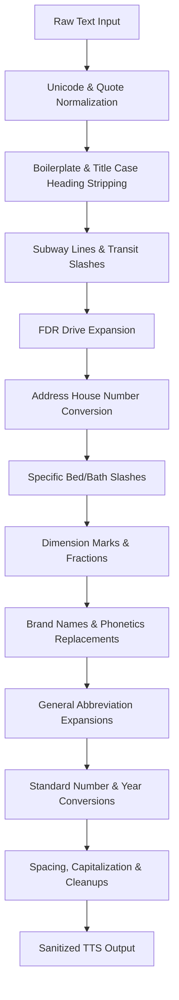

# Regex Rules Plan for TTS Text Sanitizer

This document details the plan to incorporate the manual observations from `manual_observations.md` (Chunks 1-7) into `regex-script/text_sanitizer.js`. It includes new token expansions, brand phonetics, contradiction mapping, and execution order strategies.

---

## 1. Newly Identified Patterns & Substitutions

We will add the following expansions and pronunciations grouped by category. All brand/material substitutions should be **case-insensitive** and use **word boundaries** (`\b`).

### A. Brand Names & Material Phonetics
| Raw Text | Target Pronunciation / Replacement | Category |
| :--- | :--- | :--- |
| **Miele** | "Mee-luh" | Appliance Brand |
| **Gaggenau** | "Gah-guh-now" | Appliance Brand |
| **Sub-Zero** / **SubZero** | "Sub Zero" | Appliance Brand |
| **Dornbracht** / **Dorn Bracht** | "Dorn-brakt" | Plumbing Fixtures |
| **Duravit** | "Doo-ruh-vit" | Plumbing Fixtures |
| **Toto Neorest** / **Toto** | "To-to Nee-o-rest" / "To-to" | Bath Fixtures |
| **Smallbone of Devizes** / **Smallbone Devizes** | "Small-bone of De-vye-ziz" | Cabinetry Brand |
| **Thierry Despont** | "Tee-air-ee Day-pohn" | Architect / Designer |
| **Molteni** / **Molteni&C** | "Mole-tay-nee" / "Mole-tay-nee and C" | Kitchen/Furniture |
| **Lefroy Brooks** | "Lefroy Brooks" | Plumbing Brand |
| **Lutron** / **Lutron Caseta** | "Loo-tron" / "Loo-tron Kuh-see-tah" | Lighting Automation |
| **Jean Nouvel** | "Zhahn Noo-vel" | Architect |
| **Anish Kapoor** | "Ah-neesh Kah-poor" | Artist/Sculptor |
| **Antonio Lupi** | "An-toe-nee-oh Loo-pee" | Tuscan Bath Brand |
| **DeLemos & Cordes** | "Deh-Lee-mose and Kor-deez" | Architects |
| **Onda Argentata** | "Ohn-dah Ar-jen-tah-tah" | Marble Type |
| **Covelano** | "Koe-veh-lah-noe" | Marble Type |
| **MAWD** | "M-A-W-D" | Design Firm |
| **Salvatori** | "Sal-vuh-tor-ee" | Stonework Brand |
| **Crema d'Orcia** | "Cray-muh Dor-chee-uh" | Limestone Type |
| **La Cornue** | "Lah Cor-noo" | French Oven Brand |
| **CetraRuddy** / **Cetraruddy** | "Set-ruh-rud-ee" | Architecture Firm |
| **Fior di Bosco** | "Fee-or dee Boss-co" | Italian Marble |
| **Agglo Ceppo** | "Ahg-lo Chep-o" | Honed Stone |
| **Celeste Grigio** | "Che-les-tay Gree-jo" | Marble |
| **Pelle Grigio** | "Pell-ay Gree-jo" | Marble |
| **L'École des Beaux-Arts** | "L'ay-kole day boh-zahr" | Architectural Style |
| **Studio Sofield** | "Studio So-feeld" | Design Firm |
| **P.E. Guerin** | "P E Gair-in" | Hardware Brand |
| **Bulthaup** | "Boolt-howp" | Kitchen Brand |
| **Crestron** | "Kres-tron" | Automation |
| **Rafael Viñoly** | "Rah-fah-el Vin-yoh-lee" | Architect |
| **Deborah Berke** | "De-buh-ruh Burk" | Designer |
| **Shaun Hergatt** | "Shawn Her-gat" | Chef |
| **Les Clefs d'Or** | "Lay Clay Dor" | Concierge |
| **Olson Kundig** | "Ohl-son Kun-dig" | Architecture Firm |
| **Savant** | "Sah-vahnt" | Automation |
| **Electrolux** | "Ee-lek-tro-lux" | Appliances |
| **Daikin** | "Dye-kin" | HVAC |
| **Liebherr** | "Leeb-hehr" | Refrigeration |
| **Control4** | "Control Four" | Automation |
| **Somfy** | "Sahm-fee" | Motorized Shades |
| **Phylrich** | "Fil-rich" | Fixtures |
| **Robern** | "Row-burn" | Cabinets |
| **Annabelle Selldorf** | "An-nuh-bel Sel-dorf" | Architect |
| **Vica** | "Vee-kuh" | Design Collection |
| **Scavolini** | "Skah-vo-lee-nee" | Cabinetry |
| **Clé** | "Clay" | Tile Brand |
| **Porcelanosa** | "Por-seh-lah-no-sah" | Finish Brand |
| **Thasos** | "Tah-sose" | Marble |
| **Arclinea** | "Ark-li-nay-uh" | Kitchen Design |
| **Thermador** | "Ther-muh-dor" | Appliances |
| **Lafayette A. Goldstone** | "Lah-fay-et A Gold-stone" | Architect |
| **ButterflyMX** | "Butterfly M X" | Virtual Doorman |
| **Blanco** | "Blahn-ko" | Sink Brand |
| **Inès Lamunière** | "Ee-nez Lah-mun-yair" | Architect |
| **Francois Ier** | "Francois Premier" | Architectural Style |
| **Peter Pennoyer** | "Peter Pen-noy-er" | Architect |
| **Theodore Prudon** | "Theodore Pru-don" | Architect |
| **John McCall** | "John Muh-call" | Designer |
| **Bakes & Kropp** | "Bakes and Kropp" | Cabinetry |
| **JennAir** | "Jen-Air" | Appliances |
| **Schindler** | "Shind-ler" | Elevators |
| **Andrea Miranda** | "And-ray-uh Mih-ran-duh" | Architect |
| **Randy Kemper** | "Randy Kem-per" | Designer |
| **Anthony Ingrao** | "Anthony In-gray-o" | Designer |
| **Nero Marquina** | "Nee-ro Mar-kee-nuh" | Marble |
| **Gabellini Sheppard** | "Gah-bel-lee-nee Shep-ard" | Design Firm |
| **Gilles et Boissier** / **Gilles & Boissier** | "Jeel ay Bwah-see-ay" | French Design Firm |
| **Faena** | "Fah-ay-nuh" | Luxury Hotel Brand |
| **Taj Mahal** | "Tahj Muh-hal" | Quartzite |
| **Hydrosystems** | "Hydro-systems" | Bath Brand |
| **Grigio Onyx** | "Gree-jo Onyx" | Stone |
| **Kraus Hi-Tech** | "Krow-ss High-Tech" | Audio/Video |
| **SO-IL** | "So-Ill" | Design Firm |
| **Lineadecor** | "Lin-ee-uh-decor" | Turkish Cabinetry |
| **J'adore stone** | "Jah-dor stone" | Quartzite |
| **Caesarstone** | "See-zer-stone" | Countertops |
| **Santa Marina** | "Santa Muh-ree-nuh" | Stone |
| **Buster & Punch** | "Buster and Punch" | Hardware Brand |
| **Arabescato Antico** | "Ah-ruh-beh-skah-to Ahn-tee-co" | Marble |
| **Amuneal** | "Am-u-neel" | Custom Shelving |
| **Kallista** | "Kuh-lis-tuh" | Fixtures |
| **MasterCool** | "Master Cool" | Fridge Brand |
| **Wright Fit** | "Wright Fit" | Gym Consultants |
| **Ubiquiti** | "You-bik-wit-ee" | Networking |
| **McIntosh** | "Mak-in-tosh" | High-end Audio |
| **Bowers & Wilkins** | "Bowers and Wilkins" | Speakers |
| **Nolita** | "No-lee-tuh" | Neighborhood |
| **Veselka** | "Veh-sel-kuh" | Ukrainian Restaurant |
| **McSorley's** | "Mak-sor-lees" | Historic Tavern |
| **Richard Ciccarelli** | "Richard Chi-cuh-rel-lee" | Architect |
| **Eucalyptus** | "You-cuh-lip-tus" | Wood Veneer |
| **Neuvellano** | "New-vel-lah-no" | Stone |
| **ROTTET Studio** / **Rottet Studio** | "Rot-tet Studio" | Interior Design |
| **Grigio Orobico** | "Gree-jo O-ro-bee-co" | Marble |
| **Officine Gullo** | "Oh-fee-chee-nay Gool-lo" | Italian Kitchen Brand |
| **Altamarea Group** | "Al-tuh-mah-ray-uh Group" | Restaurant Group |
| **Melamed Architect** | "Mel-ah-med Architect" | Architecture Firm |
| **Diller Scofidio + Renfro** | "Diller Sko-fee-dee-o and Ren-fro" | Architecture Firm |
| **Studio Zuchowicki** | "Studio Zoo-cho-wick-ee" | Design Firm |
| **Maryam Nassir Zadeh** | "Mah-ree-um Nah-seer Zay-deh" | Boutique / Brand |
| **Henrybuilt** | "Henry-built" | Cabinetry Brand |
| **Struxure** | "Struk-chur" | Pergolas |
| **Bromic** | "Bro-mik" | Heaters |
| **Thermory Ash** | "Ther-muh-ree Ash" | Decking Wood |
| **Renu Therapy** | "Ree-new Therapy" | Cold Plunges |
| **RiFRA** / **Rifra** | "Ree-frah" | Kitchen Design |
| **Kamp Studios** | "Kamp Studios" | Plaster Design |
| **Sow Haus** | "So House" | Design Studio |
| **Sonance** | "So-nans" | Speakers |
| **Calacatta Paonazzo** / **Calacatta Paonazzo** | "Kah-lah-kah-tah Pah-o-naht-so" | Marble |
| **La Palestra** | "Lah Pah-les-tra" | Wellness Gym |
| **Michael Aiduss** | "Michael Ay-duss" | Designer |
| **Schumacher** | "Shoo-mah-ker" | Fabric / Wallpaper |
| **Chango & Co.** | "Chang-go and Company" | Design Firm |
| **Mike Ingui** | "Mike In-gwee" | Architect |
| **AGA Elise** | "Ah-guh Eh-leez" | Classic Ranges |
| **Ipe** | "Ee-pay" | Brazilian Hardwood |
| **Beyer Blinder Belle** | "By-er Blinder Bell" | Architects |
| **Alexandra Champalimaud** | "Alexandra Sham-pah-lee-moh" | Designer |
| **Montclair Danby** | "Mont-clair Dan-bee" | Vermont Marble |
| **Allmilmo** | "All-mil-moh" | Cabinetry Brand |
| **Celador Oyster** | "Sel-uh-dor Oyster" | Quartz |
| **Pianeta Legno Aformosia** | "Pee-uh-neh-tah Leg-no Ah-for-mo-zee-uh" | Hardwood |
| **Grohe** | "Gro-he" | German Fixtures |
| **Andres Escobar** | "Andres Es-co-bar" | Designer |
| **Jessie Lookfong** | "Jessie Look-fong" | Broker |
| **London Towne House** | "London Towne House" | Co-op building |
| **SHVO** | "Shvo" | Developer |
| **Daniel Boulud** | "Daniel Boo-loo" | Chef |
| **Boulud Privé** | "Boo-loo Pree-vay" | Private Dining |
| **Marin Architects** | "Marin Architects" | Firm |
| **Ellevi** | "El-eh-vee" | Storage Closets |
| **Fischer + Makooi Architects** | "Fischer and Muh-koo-ee Architects" | Firm |
| **Alpi Wood** | "Al-pee Wood" | Veneer Brand |
| **Basaltina** | "Bah-sal-tee-nuh" | Basalt Stone |
| **James Corner Field Operations** | "James Corner Field Operations" | Landscape Firm |
| **Two Trees** | "Two Trees" | Developer |
| **Aran Cucine** | "Ah-rahn Coo-chee-nay" | Italian Kitchen Brand |
| **Printemps** | "Prahn-tahm" | French Department Store |
| **Maison Passerelle** | "Mayson Pah-seh-rel" | Retail Skybridge |
| **Salon Vert** | "Sah-lohn Vair" | Lounge |
| **Café Jalu** | "Kah-fay Zhah-loo" | Cafe |
| **Harry Macklowe** | "Harry Mack-low" | Developer |
| **Hildreth Meière** | "Hil-dreth Mee-air" | Art Deco Artisan |
| **Augsburg oak** | "Awgs-berg oak" | Wood flooring |
| **Poliform-Varenna** / **Varenna** | "Pol-ee-form Vah-ren-nuh" / "Vah-ren-nuh" | Kitchen Brand |
| **Bavarian Spessart oak** | "Bavarian Shpeh-sart oak" | Wood |
| **Caesarstone Pietra Grey** | "See-zer-stone Pee-eh-truh Grey" | Quartz |
| **Perlado Beige** | "Pair-lah-do Beige" | Marble |
| **Azul Grey** | "Ah-zool Grey" | Limestone |
| **Faber** | "Fay-ber" | Range Hoods |
| **Ariston** | "Ah-ris-ton" | Marble / Appliances |
| **Rafael de Cárdenas** | "Rah-fah-el de Car-deh-nahs" | Designer |
| **Calacatta Vagli** | "Kah-lah-kah-tah Val-yee" | Marble |
| **Didimon Light** / **Didimon** | "Did-ee-mon Light" | Marble |
| **El Ad East 74** | "El Ad East seventy-four" | Developer |
| **Siematic** / **SieMatic** | "See-matic" | Kitchen Brand |
| **Compaq** | "Kom-pak" | Technological Stone |
| **CL-OTH Interiors** | "Cloth Interiors" | Firm |
| **Fulgor Milano** | "Fool-gor Mee-lah-no" | Appliance Brand |
| **Schiffini** | "Shee-fee-nee" | Kitchen Brand |
| **Neptune Zen** | "Neptune Zen" | Tub Brand |
| **Noir St. Laurent** | "Nwahr San Law-rahn" | French Marble |
| **Agata & Valentina** | "Ah-gah-tah and Val-en-tee-nah" | Specialty Market |
| **Rimadesio** | "Ree-mah-day-zyoh" | Italian Closets |
| **Valcucine** | "Val-coo-chee-nay" | Kitchen Brand |
| **Neil Denari** | "Neil Deh-nah-ree" | Architect |
| **RIVAA Gallery** | "Ree-vah Gallery" | Roosevelt Island Gallery |
| **Gronenberg and Leuchtag** | "Grow-nen-berg and Loyk-tag" | Architects |
| **LaGuardia Design Group** | "Lah-gward-ee-ah Design Group" | Landscape |
| **Ceppo Bianco** | "Cheh-poe Bee-ahn-koe" | Terrazzo Stone |
| **Dormakaba** | "Dor-mah-kah-bah" | Smart Locks |
| **Birley Bakery** | "Bur-lee Bakery" | Bakery |
| **Le Charlot** | "Luh Shar-low" | Bistro |
| **Marcel’s** | "Mar-sellz" | Cafe |
| **Daino Reale** | "Dye-noe Ray-ah-lay" | Marble |
| **Ingrao Inc.** | "In-gray-oh Incorporated" | Design Firm |
| **Ornare** | "Or-nah-ray" | Cabinet Brand |
| **Schwartz & Gross** | "Shwartz and Grose" | Architects |
| **Lazza** | "Laht-sah" | Glass Surface |
| **Reuveni LLC** | "Reh-oo-ven-ee L-L-C" | Brokerage |
| **Anish Kapoor** | "Ah-neesh Kah-poor" | Sculptor |
| **Antonio Lupi** | "An-toe-nee-oh Loo-pee" | Tuscan soaking tubs |
| **DeLemos & Cordes** | "Deh-Lee-mose and Kor-deez" | Architects |
| **Sabrina Condominium** / **Sabrina** | "Suh-bree-nuh Condominium" | Building Name |
| **Covelano marble** | "Koe-veh-lah-noe marble" | Marble |

### B. Acronyms (Case-Sensitive, Letter-by-Letter)
We will expand these acronyms using case-sensitive matches to avoid colliding with regular lowercase English words.
* `\bBBL\b` -> `B-B-L`
* `\bBAM\b` -> `B-A-M`
* `\bADA\b` -> `A-D-A`
* `\bNOI\b` -> `N-O-I`
* `\bLIRR\b` -> `L-I-R-R`
* `\bFAR\b` -> `F-A-R` (resolves collision with the word "far")
* `\bSTAR\b` -> `Star` (resolves collision with "star")
* `\bPILOT\b` -> `Pilot` (resolves collision with "pilot")
* `\bLEED\b` -> `Leed` (resolves collision with "leed")
* `\bZIP\b` -> `zip`

---

## 2. Contradiction Mapping & Rule Collisions

Here we analyze specific edge cases where rules might overlap or corrupt data if executed in the wrong order:

### A. FDR (Formal Dining Room) vs. FDR Drive
* **The Problem**: Standalone `FDR` means "formal dining room". But in `FDR Drive`, it refers to the highway in Manhattan, which must be spoken as `F-D-R Drive`.
* **Resolution**: Replace `\bFDR\s+[Dd]rive\b` with `F-D-R Drive` *before* running the general `\bFDR\b` -> `formal dining room` rule.

### B. A/C (Air Conditioning) vs. A/C Subway Lines
* **The Problem**: `A/C` means "air conditioning". But in `A/C subway lines` or `A/C trains` or lists like `A/C/E`, it refers to transit lines and should be spoken as `A and C`.
* **Resolution**: Replace specific transit lists like `\b[A-Z]\/[A-Z]\/[A-Z]\b` (e.g. `A/C/E`, `B/D/F`) or instances like `\bA\/C\s+(?:subway|train|line|station)s?\b` first to splay them (e.g. `A and C subway`), then let the general `\bA\/C\b` case-insensitive rule replace remaining instances with `air conditioning`.

### C. St. (Street vs. Saint)
* **The Problem**: `St.` can mean "Street" (e.g. `49th St.`) or "Saint" (e.g. `St. Luke's`).
* **Resolution**:
  1. If `St.` is preceded by a digit/ordinal, it must expand to `Street`:
     `\b(\d+(?:st|nd|rd|th)?)\s+St\.?\b/gi` -> `$1 Street`
  2. If `St.` is followed by a capitalized word (and not preceded by a number), it must expand to `Saint`:
     `(?<!\d+(?:st|nd|rd|th)?\s+)\bSt\.?\s+([A-Z][a-z]+)\b/g` -> `Saint $1`
  3. Standalone references (e.g. `St. Mark's Place` or `St. George's`) are naturally caught by the Saint rule.

### D. Subway Line Slashes (e.g. 2/3/4/5 or 2/5 or Q/R)
* **The Problem**: A general slash-replacement rule converts `word1/word2` to `word1 and word2`. For subway lines like `2/5`, this becomes `two and five`, which is correct. However, for bedroom/bath slash combinations (like `2bed/2bath` or `1BR/1BA`), a general slash rule turns them into `two bedroom and two bath` which sounds clunky compared to the standard real estate voiceover phrasing: `two bedroom, two bath`.
* **Resolution**: Run specific bed/bath slash regexes first:
  `\b(\d+)\s*(?:BR|br|bed|bedroom)s?\s*\/\s*(\d+(?:\.5)?)\s*(?:BA|ba|bath|bathroom)s?\b/gi` -> `$1 bedroom, $2 bath`.

### E. Double Quotes (`10'3""` and Escaped Quotes)
* **The Problem**: In raw CSV exports, double-quotes representing inches are often escaped or typed as two single double-quotes: `10'3""`. If we run number conversions first, this might turn into `ten feet three inches""` or cause spacing errors.
* **Resolution**: Sanitize and normalize smart quotes and duplicate quotes at the very beginning of the pipeline:
  `t = t.replace(/""/g, '"');`
  `t = t.replace(/’|‘/g, "'").replace(/”|“/g, '"').replace(/′/g, "'").replace(/″/g, '"');`

---

## 3. Advanced Address House Number Pronunciation

In US real estate, house numbers are spoken using grouping rather than standard cardinal numbers:
* `1420 York Avenue` -> "fourteen twenty York Avenue" (not "one thousand four hundred twenty")
* `155 East 49th Street` -> "one fifty-five East forty-ninth Street" (not "one hundred fifty-five")
* `870 United Nations Plaza` -> "eight seventy United Nations Plaza"
* `2099 Fifth Avenue` -> "twenty ninety-nine Fifth Avenue"

We will implement a helper `convertHouseNumber(numStr)` and run it over detected street addresses:

```javascript
function convertHouseNumber(numStr) {
    const num = parseInt(numStr, 10);
    if (isNaN(num)) return numStr;
    if (num < 100 || num > 9999) return convertNumberToWords(numStr);
    
    if (num >= 100 && num <= 999) {
        const hundreds = Math.floor(num / 100);
        const tens = num % 100;
        if (tens === 0) {
            return convertNumberToWords(hundreds) + ' hundred';
        } else if (tens < 10) {
            return convertNumberToWords(hundreds) + ' oh ' + convertNumberToWords(tens);
        } else {
            return convertNumberToWords(hundreds) + ' ' + convertNumberToWords(tens);
        }
    } else if (num >= 1000 && num <= 9999) {
        const thousands = Math.floor(num / 100);
        const tens = num % 100;
        if (num === 2000) return 'two thousand';
        if (tens === 0) {
            return convertNumberToWords(thousands) + ' hundred';
        } else if (tens < 10) {
            return convertNumberToWords(thousands) + ' oh ' + convertNumberToWords(tens);
        } else {
            return convertNumberToWords(thousands) + ' ' + convertNumberToWords(tens);
        }
    }
    return convertNumberToWords(numStr);
}
```

### Addressing Regex Patterns
To match house numbers without incorrectly converting standard floor heights or counts:
1. **Numbered Street/Avenue Addresses**:
   `\b(\d{3,4})\s+(East|West|North|South|[EWNSewns]\.?)\s+(\d+(?:st|nd|rd|th)?)\s+(Street|Avenue|St\.?|Ave\.?)\b/gi`
2. **Named Street Addresses**:
   `\b(\d{3,4})\s+(East|West|North|South|[EWNSewns]\.?)\s+([A-Z][a-zA-Z]+(?:\s+[A-Z][a-zA-Z]+)*)\s+(Street|Avenue|Road|Place|Boulevard|St\.?|Ave\.?|Rd\.?|Pl\.?|Blvd\.?|Plaza|Loop|Drive|Dr\.?)\b/g`
3. **General Named Street (No Directional Prefix)**:
   `\b(\d{3,4})\s+([A-Z][a-zA-Z]+(?:\s+[A-Z][a-zA-Z]+)*)\s+(Street|Avenue|Road|Place|Boulevard|St\.?|Ave\.?|Rd\.?|Pl\.?|Blvd\.?|Plaza|Loop|Drive|Dr\.?)\b/g`

---

## 4. Pipeline Execution Sequence

To ensure no rule corrupts another, the sanitizer pipeline inside `cleanTextForTTS` will be structured as follows:



---

## 5. Next Steps

1. Add corresponding test cases to `test_sanitizer.js` to assert:
   * Brand pronunciations (`Cetraruddy` -> `Set-ruh-rud-ee`, `Miele` -> `Mee-luh`, etc.)
   * Address groupings (`1420 York Ave` -> `fourteen twenty York Avenue`, `155 E 49th St` -> `one fifty-five East forty-ninth Street`)
   * Correct ordering of `FDR Drive` vs `FDR`
   * Correct ordering of `A/C subway` vs `A/C`
2. Implement the refactored sanitizer in `regex-script/text_sanitizer.js`.
3. Run `node scratch/test_sanitizer.js` to ensure all tests pass.
4. Process real dataset overviews.
